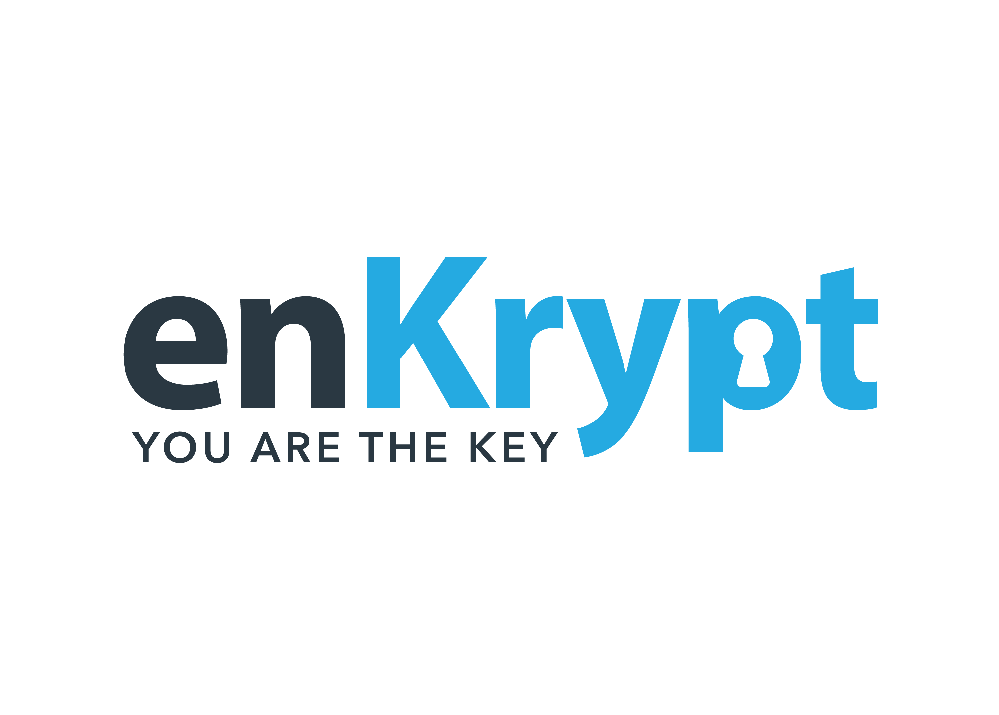

[![Contributors][contributors-shield]][contributors-url]
[![Forks][forks-shield]][forks-url]
[![Stargazers][stars-shield]][stars-url]
[![Issues][issues-shield]][issues-url]
[![MIT License][license-shield]][license-url]


<!-- PROJECT LOGO -->
<br />
<div align="center">
  <a href="https://github.com/enkryptcom/enKrypt">
    
  </a>

  <h3 align="center">enKrypt</h3>

  <p align="center">
    Universal web3 extension
    <br />
    <a href="#"><strong>Explore the docs »</strong></a>
    <br />
    <br />
    ·
    <a href="https://github.com/enkryptcom/enKrypt/issues">Report Bug</a>
    ·
    <a href="https://github.com/enkryptcom/enKrypt/issues">Request Feature</a>
  </p>
</div>

<!-- ABOUT THE PROJECT -->
## About The Project

> [add screenshot]

> [write description]

<p align="right">(<a href="#top">back to top</a>)</p>


### Built With

* [Typescript](https://www.typescriptlang.org/)
* [Vue.js](https://vuejs.org/)

<p align="right">(<a href="#top">back to top</a>)</p>


<!-- GETTING STARTED -->
## Getting Started

To get started make sure you have `nodejs` and `nvm` installed on your system

### Prerequisites

* npm
  ```sh
  nvm install 16
  nvm use 16
  npm install yarn -g
  ```

### Installation

1. Clone the repo
   ```sh
   git clone https://github.com/enkryptcom/enKrypt.git
   ```
2. Install NPM packages
   ```sh
   yarn install
   ```

<p align="right">(<a href="#top">back to top</a>)</p>


<!-- USAGE EXAMPLES -->
## Usage

Use this space to show useful examples of how a project can be used. Additional screenshots, code examples and demos work well in this space. You may also link to more resources.

_For more examples, please refer to the [Documentation](https://example.com)_

<p align="right">(<a href="#top">back to top</a>)</p>


See the [open issues](https://github.com/enkryptcom/enKrypt/issues) for a full list of proposed features (and known issues).

<p align="right">(<a href="#top">back to top</a>)</p>


<!-- CONTRIBUTING -->
## Contributing

Contributions are what make the open source community such an amazing place to learn, inspire, and create. Any contributions you make are **greatly appreciated**.

If you have a suggestion that would make this better, please fork the repo and create a pull request. You can also simply open an issue with the tag "enhancement".
Don't forget to give the project a star! Thanks again!

1. Fork the Project
2. Create your Feature Branch (`git checkout -b feature/AmazingFeature`)
3. Commit your Changes (`git commit -m 'Add some AmazingFeature'`)
4. Push to the Branch (`git push origin feature/AmazingFeature`)
5. Open a Pull Request

<p align="right">(<a href="#top">back to top</a>)</p>


<!-- LICENSE -->
## License

Distributed under the MIT License. See `LICENSE.md` for more information.

<p align="right">(<a href="#top">back to top</a>)</p>


<!-- CONTACT -->
## Contact

Your Name - [@your_twitter](https://twitter.com/your_username) - email@example.com

Project Link: [https://github.com/your_username/repo_name](https://github.com/your_username/repo_name)

<p align="right">(<a href="#top">back to top</a>)</p>


<!-- ACKNOWLEDGMENTS -->
## Acknowledgments

Use this space to list resources you find helpful and would like to give credit to. I've included a few of my favorites to kick things off!

* [Choose an Open Source License](https://choosealicense.com)
* [GitHub Emoji Cheat Sheet](https://www.webpagefx.com/tools/emoji-cheat-sheet)
* [Malven's Flexbox Cheatsheet](https://flexbox.malven.co/)
* [Malven's Grid Cheatsheet](https://grid.malven.co/)
* [Img Shields](https://shields.io)
* [GitHub Pages](https://pages.github.com)
* [Font Awesome](https://fontawesome.com)
* [React Icons](https://react-icons.github.io/react-icons/search)

<p align="right">(<a href="#top">back to top</a>)</p>


<!-- MARKDOWN LINKS & IMAGES -->
<!-- https://www.markdownguide.org/basic-syntax/#reference-style-links -->
[contributors-shield]: https://img.shields.io/github/contributors/enkryptcom/enKrypt.svg?style=for-the-badge
[contributors-url]: https://github.com/enkryptcom/enKrypt/graphs/contributors
[forks-shield]: https://img.shields.io/github/forks/enkryptcom/enKrypt.svg?style=for-the-badge
[forks-url]: https://github.com/enkryptcom/enKrypt/network/members
[stars-shield]: https://img.shields.io/github/stars/enkryptcom/enKrypt.svg?style=for-the-badge
[stars-url]: https://github.com/enkryptcom/enKrypt/stargazers
[issues-shield]: https://img.shields.io/github/issues/enkryptcom/enKrypt.svg?style=for-the-badge
[issues-url]: https://github.com/enkryptcom/enKrypt/issues
[license-shield]: https://img.shields.io/github/license/enkryptcom/enKrypt.svg?style=for-the-badge
[license-url]: https://github.com/enkryptcom/enKrypt/blob/main/README.md
