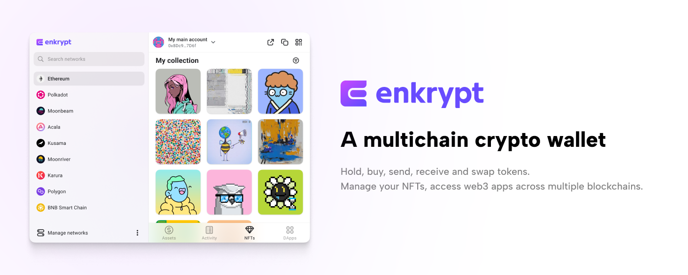

<br />
<div align="center">
  <a href="https://github.com/enkryptcom/enKrypt">
    
  </a>

  <h3 align="center">Enkrypt</h3>

  <p align="center">
    Everything in the blockchain made easy
    <br />
    <a href="https://chrome.google.com/webstore/detail/enkrypt-ethereum-and-polk/kkpllkodjeloidieedojogacfhpaihoh">
      <strong>Download for Chrome/Brave »</strong>
    </a>
    <br />
    <br />
    ·
    <a href="https://github.com/enkryptcom/enKrypt/issues">Report Bug</a>
    ·
    <a href="https://github.com/enkryptcom/enKrypt/issues">Request Feature</a>
  </p>
</div>

<!-- ABOUT THE PROJECT -->

## About Enkrypt

Enkrypt is a web3 wallet built from the ground up to support the multi-chain future. Send, receive, swap, manage your tokens and NFTs, and interact with dapps on all of your favorite chains with just a few clicks. With only one seed phrase for all of your accounts Enkrypt makes it easy to manage your assets and stay secure. If you're looking for that extra layer of security Enkrypt also supports popular hardware wallets such as Ledger and Trezor.

<p align="right">(<a href="#top">back to top</a>)</p>

## Currently Supported Chains

- Ethereum
- Polygon
- BNB Smart Chain
- Moonbeam
- Moonriver
- Karura EVM
- Ethereum Classic
- Polkadot
- Kusama
- Edgeware
- Acala
- Karura
- TomoChain
- Arbitrum
- Gnosis
- Avalanche
- Fantom
- Klaytn
- Aurora
- Ontology
- Puppy Net
- More coming soon!

Looking to add your project? [Contact us!](https://mewwallet.typeform.com/enkrypt-inquiry?typeform-source=www.enkrypt.com)

<p align="right">(<a href="#top">back to top</a>)</p>

### Built With

- [Typescript](https://www.typescriptlang.org/)
- [Vue.js](https://vuejs.org/)

<p align="right">(<a href="#top">back to top</a>)</p>

<!-- GETTING STARTED -->

## Getting Started

To get started make sure you have `nodejs` and `nvm` installed on your system

### Prerequisites

- npm
  ```sh
  nvm install 16
  nvm use 16
  npm install yarn -g
  ```

### Installation

1. Clone the repo
   ```sh
   git clone https://github.com/enkryptcom/enKrypt.git
   ```
2. Install NPM packages
   ```sh
   yarn install
   ```
3. Build the project and watch for changes
   ```sh
   yarn watch-extension # chromium based browsers
   yarn watch:firefox # firefox
   ```
4. Build the project for release
   ```sh
   yarn build:all
   yarn build:chrome # chromium based browsers
   yarn build:firefox # firefox
   ```
5. Add to your browser
   - [Chrome/Brave/Opera](https://developer.chrome.com/docs/extensions/mv2/getstarted/#manifest)
   - [Firefox](https://developer.mozilla.org/en-US/docs/Mozilla/Add-ons/WebExtensions/Your_first_WebExtension#installing)

<p align="right">(<a href="#top">back to top</a>)</p>

<!-- CONTRIBUTING -->

## Contributing

Contributions are what make the open source community such an amazing place to learn, inspire, and create. Any contributions you make are **greatly appreciated**.

If you have a suggestion that would make this better, please fork the repo and create a pull request. You can also simply open an issue with the tag "enhancement".
Don't forget to give the project a star! Thanks again!

1. Fork the Project
2. Create your Feature Branch (`git checkout -b feature/AmazingFeature`)
3. Commit your Changes (`git commit -m 'Add some AmazingFeature'`)
4. Push to the Branch (`git push origin feature/AmazingFeature`)
5. Open a Pull Request

<p align="right">(<a href="#top">back to top</a>)</p>

<!-- LICENSE -->

## License

Distributed under the MIT License. See `LICENSE.md` for more information.

<p align="right">(<a href="#top">back to top</a>)</p>

<!-- CONTACT -->

## Contact

Twitter - [@enkrypt](https://twitter.com/enkrypt)

Email - info@enkrypt.com

Homepage - [https://www.enkrypt.com/](https://www.enkrypt.com/)

<p align="right">(<a href="#top">back to top</a>)</p>
